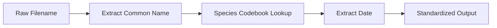
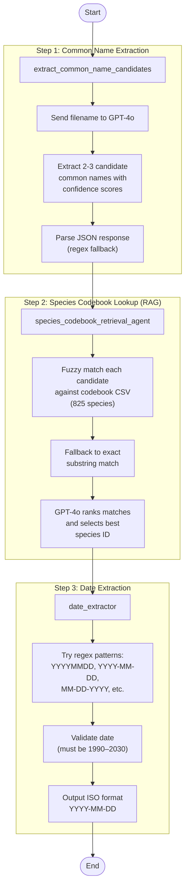
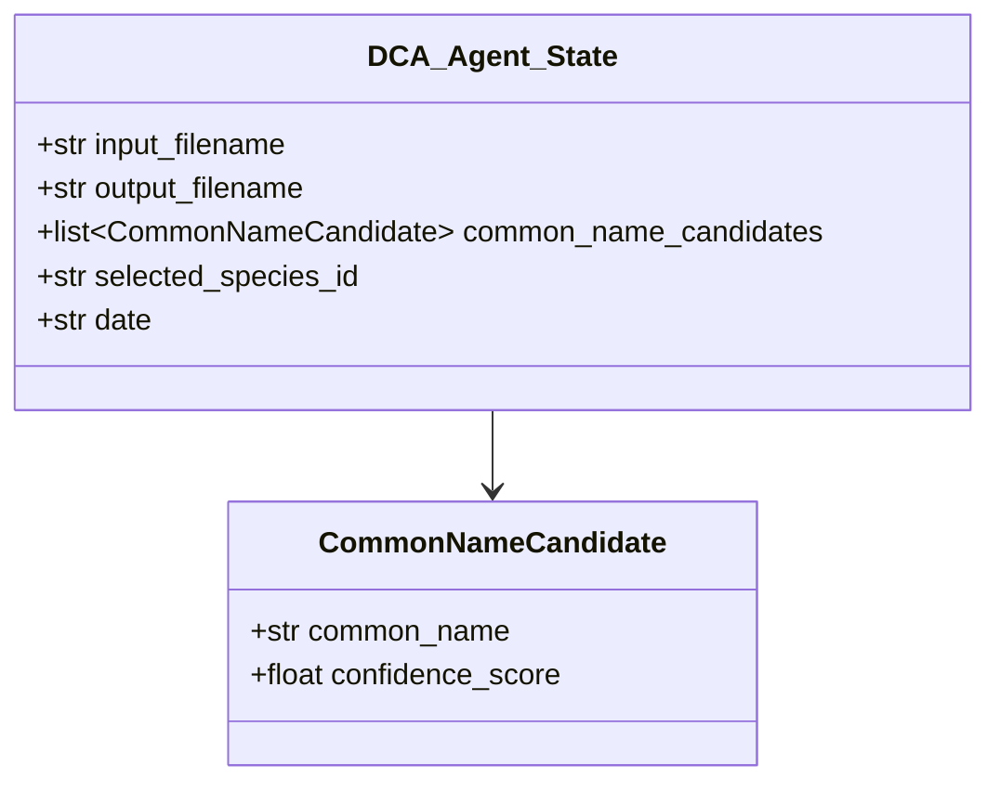

# Dear Ocean — Digital Coral Ark Agent

## About the Project

Dear Ocean is building a growing photo and video library of coral reefs that are at risk — by collecting footage from people everywhere, past and present. We're here to save the visual history of these reefs before it's lost, get more people to care about what's happening to them, show how much reefs have actually changed over time, and help guide efforts to bring them back.

## About the Agent

The DCA Agent is a custom workflow that handles the process of renaming and rewriting files for the purposes of maintaining a consistent naming format across the archive. Previously, this was done in a manual format; however, we were able to change this with the introduction of LLMs.

The agent takes a raw coral reef filename as input, extracts structured metadata from it (species name, species ID, date), and produces a standardized output — all powered by GPT-4o and orchestrated with [LangGraph](https://github.com/langchain-ai/langgraph).

## How It Works

The workflow is a three-step pipeline. Each step is a node in a LangGraph state graph, and they run sequentially — passing state from one to the next.

### High-Level Flow



### Detailed Workflow



### State Schema

Each step reads from and writes to a shared state object:



### Example

**Input filename:**
```
Antler Coral Pocillopora eydouxi entangled Hanauma Bay 20210421_25_Roberts_Anke - HAN.JPG
```

**Output state:**

| Field | Value |
|-------|-------|
| `common_name_candidates` | `[{common_name: "Antler Coral", confidence_score: 0.95}, ...]` |
| `selected_species_id` | `ANTCOR` |
| `date` | `2021-04-21` |

## Project Structure

```
Dear_Ocean_Digital_Coral_Ark_Agent/
├── README.md
├── requirements.txt
├── .env.SAMPLE
├── data/
│   ├── codebook/
│   │   └── Master - DCA Metadata Codebook - Master.csv   # 825-row species reference
│   └── input/                                             # Raw coral reef image files
└── src/
    ├── workflow.py                 # LangGraph workflow orchestration (entry point)
    ├── ai_client.py               # GPT-4o abstraction layer
    ├── models.py                  # Pydantic state models
    ├── common_name_extractor.py   # Step 1 — extract coral common names via AI
    ├── species_codebook_rag.py    # Step 2 — fuzzy match + AI ranking against codebook
    ├── date_extractor.py          # Step 3 — regex-based date extraction
    └── db/
        └── species_codebook.py    # Codebook CSV loader + fuzzy/exact search
```

## Installing

### Prerequisites

- Python 3.10+
- An [OpenAI API key](https://platform.openai.com/api-keys)
- (Optional) A [LangSmith API key](https://smith.langchain.com/) for tracing and debugging

### Setup

1. Clone the repository:

    ```bash
    git clone https://github.com/your-org/Dear_Ocean_Digital_Coral_Ark_Agent.git
    cd Dear_Ocean_Digital_Coral_Ark_Agent
    ```

2. Create and activate a virtual environment:

    ```bash
    python3 -m venv venv
    source venv/bin/activate
    ```

3. Install dependencies:

    ```bash
    pip install -r requirements.txt
    ```

4. Configure environment variables:

    ```bash
    cp .env.SAMPLE .env
    ```

    Then fill in your `.env` file:

    ```env
    OPENAI_API_KEY=your-openai-key
    LANGSMITH_API_KEY=your-langsmith-key
    LANGSMITH_TRACING=true
    LANGSMITH_PROJECT=langchain-academy
    ```

    > If you skip this step, the agent will prompt you for credentials at runtime.

## Running

From the project root:

```bash
cd src
python workflow.py
```

By default this processes the sample file in `data/input/`. To process a different file, edit the `input_filename` in `workflow.py` or import and call `run_workflow()` directly:

```python
from workflow import run_workflow

result = run_workflow("your-coral-image-filename.JPG")
print(result)
```

## Tech Stack

| Technology | Role |
|------------|------|
| [LangGraph](https://github.com/langchain-ai/langgraph) | Workflow orchestration |
| [OpenAI GPT-4o](https://platform.openai.com/) | LLM for name extraction and species ranking |
| [LangSmith](https://smith.langchain.com/) | Observability and tracing |
| [Pydantic](https://docs.pydantic.dev/) | Type-safe state models |
| [pandas](https://pandas.pydata.org/) | Codebook CSV handling |
| [thefuzz](https://github.com/seatgeek/thefuzz) | Fuzzy string matching |
